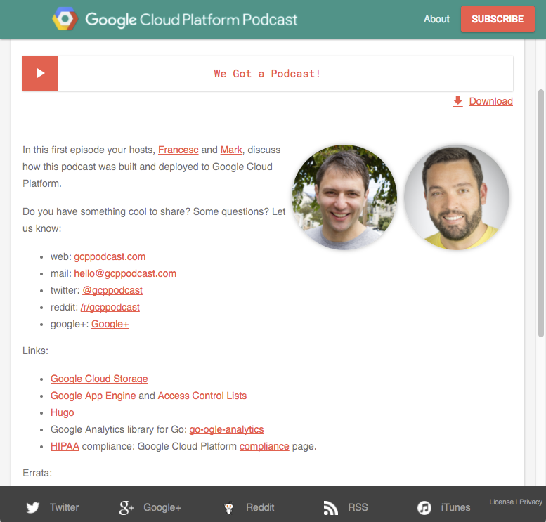

# GCP Podcast Website

This repo contains all the code and contents behind [gcppodcast.com](https://www.gcppodcast.com).

The first episode explains the architecture, you can listen to it
[here](https://gcppodcast.com/post/episode-1-we-got-a-podcast/).

# Contents of the repository

You will find three directories in the repository, `dev`. `ga_handler`, and `site`.

- dev: 
- ga_handler: an App Engine module written in Python used to send events to Google Analytics
- site: the [hugo](https://gohugo.io) structure that generates the static website

## dev: website development

This directory contains all the tooling we use to build/deploy the podcast.
In particular it has a `Dockerfile` that defines an environment with all the tools we
use to generate the website and tag `mp3` files.

You can build this image using the `Makefile` on the root of this repository.
You will be able to push it or pull it from
[Google Container Registry](https://cloud.google.com/container-registry/) too,
but you might need to modify the `TAG` variable to match a project you have
access to.

Finally, once you've built the image, you should be able to create a new interactive
shell by running `make shell` or `make attach` if you want to attach to an existing one.

### site: the [hugo](https://gohugo.io) structure that generates the static website

This directory contains all the resources that we use to generate the podcast website.

You can use the `Makefile` provided in the directory to:

- Run Interactive Hugo Server (port 1313): `make server`
- Sassify->CCS Assets: `make assets-update` - does production css generation, compressed and everything.
- Deploy the Project to App Engine:
  - `make deploy` - This will not make the version default. Useful if you just want to test/share a version live.
  - `make deploy-default` - This will replace the default version (but the old version is kept, in case)

### ga_handler: adding Google Analytics to Google Cloud Storage

This directory contains an [App Engine](https://cloud.google.com/appengine) service
that provides a way to access the `mp3` files stored in [Google Cloud Storage](https://cloud.google.com/storage)
while logging those accesses with [Google Analytics](https://analytics.google.com).

The following commands can be run from inside the `ga_handler` directory:

- Run full code lint and tests: `nox`
- Start Local Episode Redirect Module: `python main.py`
- Deploy Episode Redirect Module: `gcloud app deploy`

### Disclaimer

This is not an official Google product (experimental or otherwise), it is just
code that happens to be owned by Google.